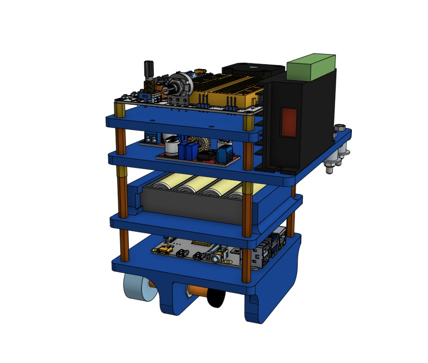
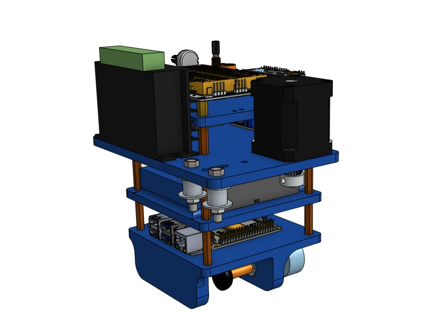

# Final Engineering Design Project

## Project Overview
This repository contains the CAD assemblies and electronic specifications for the final design project. The system is designed with a focus on modularity and ease of assembly, utilizing standardized fasteners and common manufacturing techniques.

## Folder Structure
├── base/
│   ├── 3d/                     # 3d parts for base assembly
│   ├── BOM of base_assembly.csv
│   ├── BOM of base_electronic_assembly.csv
│   ├── BOM of base_rasppi_assembly.csv
│   ├── BOM of battery_base_assembly.csv
│   └── BOM of pico_base_assembly.csv
├── flipper/
│   ├── 3d/                     # 3d parts for flipper assembly
│   ├── plexy/                  # plexy parts for flipper assembly   
|   └── BOM of flipper_v2_assembly.csv       
└── media/                      # Assembly and manufacturing images
└── pc_client_code/             # MicroPython code for Pico W
    

## Manufacturing Specifications
* **3D Printing:** Primary structural components are printed using **PLA**.
* **Laser Cutting:** Support plates and enclosures are manufactured from **Plexiglass**.
* **Fasteners:** For maintenance convenience and standardization, the entire assembly utilizes **M3 Hex Socket Screws** exclusively.

---

---

## CAD Design & Assembly

### 1. Robot Base
The primary chassis of the robot, housing the 18650 battery pack, 4S BMS, and power regulation systems. This section serves as the structural foundation for the entire assembly.

### 2. Flipper Mechanism
The active actuation system of the robot. This folder contains the designs for the Nema17 stepper mounts, the MG90S servo integration, and the mechanical linkages responsible for the flipping motion.

### 3. Table Assembly
The stationary or receiving platform of the design. It incorporates the laser-cut Plexiglass panels for visibility and structural alignment, secured with the standardized M3 hex socket screw interface.

---

## Electronics
The system is powered by a high-discharge battery configuration and controlled via a Raspberry Pi Pico W architecture.

| Component | Quantity | Description |
| :--- | :--- | :--- |
| **Raspberry Pi Pico W** | 1 | Main microcontroller for logic and wireless connectivity. |
| **MechaBoard** | 1 | Integrated carrier board. [View on GitHub](https://github.com/rustemsevik/pico-Breadboard-Kit/tree/5a5b2b6fdedf8019d1d9c465f88ec24519eb11b5) |
| **18650 Li-ion Cells** | 4 | Primary power source (4S configuration). |
| **4S BMS** | 1 | Battery Management System for charging and protection. |
| **XL 4015** | 2 | Adjustable step-down voltage regulators for logic and motors. |
| **Nema17 Stepper** | 1 | High-torque motor for primary actuation. |
| **Microstepper Driver** | 1 | Controls the Nema17 with high microstepping resolution. |
| **MG90S Servo** | 1 | Metal-geared micro servo for auxiliary movement. |
| **Limit Switch** | 2 | Used for homing and physical end-stop detection. |

---

## Assembly Quick-Start
1.  **Fabrication:** Print PLA parts and laser cut Plexiglass components.
2.  **Hardware:** Gather M3 hex socket screws for all mechanical connections.
3.  **Electronics:** Mount the Pico W onto the MechaBoard and configure the XL 4015 regulators to the required voltages before connecting logic components.
4.  **Firmware:** Upload the control script to the Pico W.